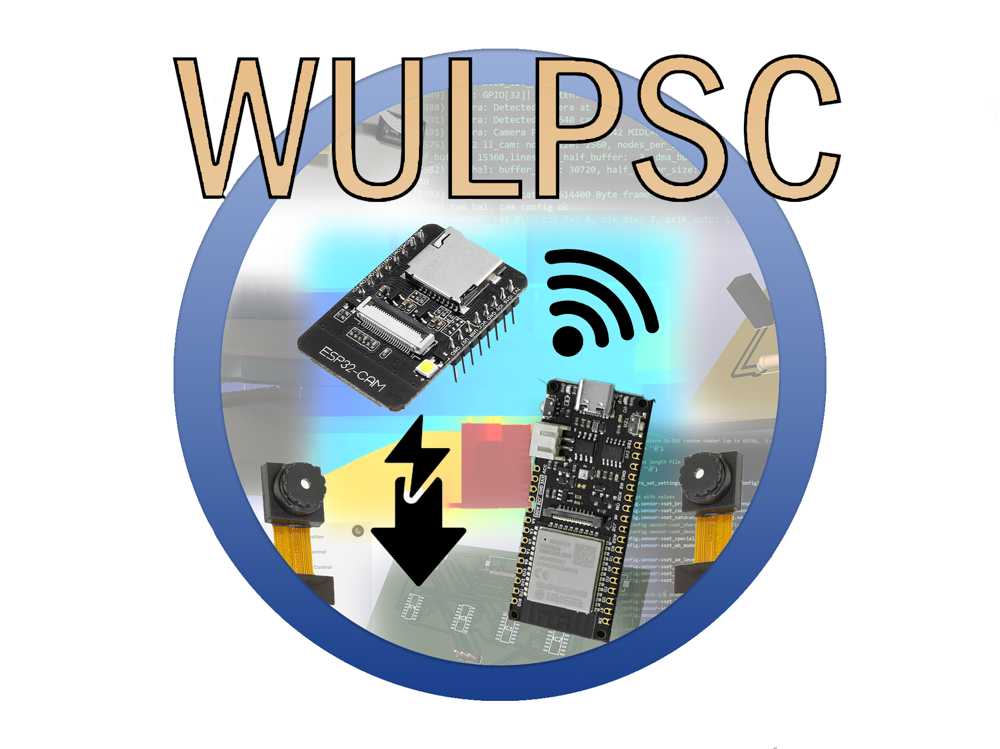

# WiFi Ultra-Low Power Stereo Camera (WULPSC)

<h1 align="center">
  

## Description
Code for the 19520 MEng Group Project at the University of Strathclyde created by Group I (Aneel Amjad, Raheel Amjad, Andreas Gavrielidies, Kostantinos Gkogkalatze, and Yiannis Michael). This repo contains all of the microcontroller code for the project. Responsibility for the microcontroller code was taken on by myself (Yiannis Michael) with some help facilitating communication to the server backend by Aneel Amjad and Raheel Amjad. Two microcontrollers were used, an ESP32-CAM for the MMC, and a FireBeetle 2 ESP32-E for the WUC.

## Setup Environment
To develop for this project there some steps to setup the environment for building and flashing. VS Code is the chosen IDE and each folder in the main branch (i.e. ``MMC`` or ``WUC``) should be opened in VS Code as a folder. This can be done by opening a terminal, navigating to the cloned directory and typing the command ``code .``, or by opening VS Code and going to ``File > Open Folder``.  The reason for this is that each folder is setup as an individual ESP-IDF project. To setup ESP-IDF and the IDE, please follow the steps below,

  - Step 1. Donwload ESP-IDF Toolchain (v5.1.2) [here](https://docs.espressif.com/projects/esp-idf/en/latest/esp32/get-started/windows-setup.html) and install normally.

 - Step 2. Make note of the installed `IDF_PATH` and `IDF_TOOLS_PATH` , they should be listed in the final screen of the installer.

 - Step 3. Download [Python](https://www.python.org/downloads/) (any 3.8+ version) and the newest version of [Git](https://git-scm.com/downloads) (using 2.43.0). This to handle some issues with IDF donwloading it's own Python and Git versions.

 - Step 4. Setup the [VS Code Extension for ESP32-IDF](https://github.com/espressif/vscode-esp-idf-extension/blob/master/docs/tutorial/install.md) and select `Existing Setup`. Put the corresponding paths in the text boxes and install. If any issues arise relating to Python/Pip or Git, delete the `C:\Espressif\tools\idf-python` or `C:\Espressif\tools\idf-git` folders and retry.

 - Step 5. Clone the repo `git clone https://github.com/ymich9963/WULPSC`

 - Step 6. Open the project folder in VS Code, press `CTRL + SHIFT + P` and type `>Add vscode configuration folder`. This is to add your own paths to the tools to build and flash the project.

 - Step 7. Have fun.

 ## Troubleshooting
 Make sure the VSCode configuration folder exists and the directories are correct. Delete any auto-generated files or folders and rebuild if it won't build. To flash you will need to setup the correct COMx port and choose UART when doing so. 

 For WiFi to work in some cases port forwarding or placing the IP address into the DMZ may be required if errors occur. PLease advise your internet service provider for doing so.
